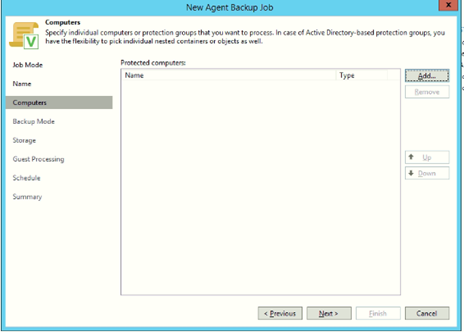

**Purpose:** Install Veeam agent on selected endpoint to Veeam console

**Scope:** Add an endpoint to Veeam, place it in a protection plan and create and test a back up

**Target:** Endpoint the backup is being made from or restored to

**Prerequisites:** System must be supported by Veeam, job must be checked for requirements not technically supported.

## 1.0 First Preparatory Activity-Plan

**The following information is needed:**

- System OS and machine tyoe to be protected (ex. CentOS 7 or Windows, Host or VM)
- System credentials for the endpoint to be protected
- Repository Identified and required space confirmed
- Backup Type, scope, and frequency
- Identification of files or folders or Directores if relevant

## 2.0 Second Activiy- Do

### Create a backup job on the Veeam Dashboard on the Veeam Server.

Our example is a Linux OS machine host

This job is being created as a server based (Veeam Server) backup

:::note

**Example backup job is for compute5**

:::

The backup job **Name** should either follow a naming convention or be unique and identifiable. A single endpoing may have multiple jobs.

### Computers Section

Click **Individual Computer**  

:::tip

** IP used instead of Hostname (compute5 in example). Use IP if hostname does not resolve.**

:::

**Note credentials chosen above**

### Backup Mode Section

Select 'Entire Computer'

### Storage Section

In this example there is only a single restore point selected.

### Guest Processing Section

No option is selected here.

### Schedule Section

No periodicity is selected.

### Summary Section

Creation of job to this point with all needed information should take approximately 10 minutes.

## 3.0 Third Activiy- Check

A job can be checked following its first run with status and feedback information. This data can and should be referenced regulary to ensure backups are occurring successfully and appropriately.

## 4.0 Verify Backup File

Once a backup job has been configured and been successful in creating a backup verification of the file can be accomplished by going to the location of the backup file. This hould be reachable by selecting the correct repository under 'HOME>Backups'

Full backup for test example compute5 is 3.11 GB.

For more information please contact aaronsmith@sandiego.edu

